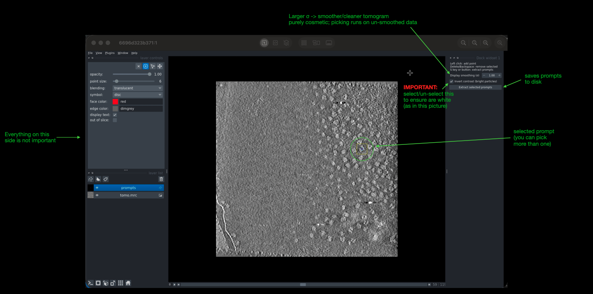
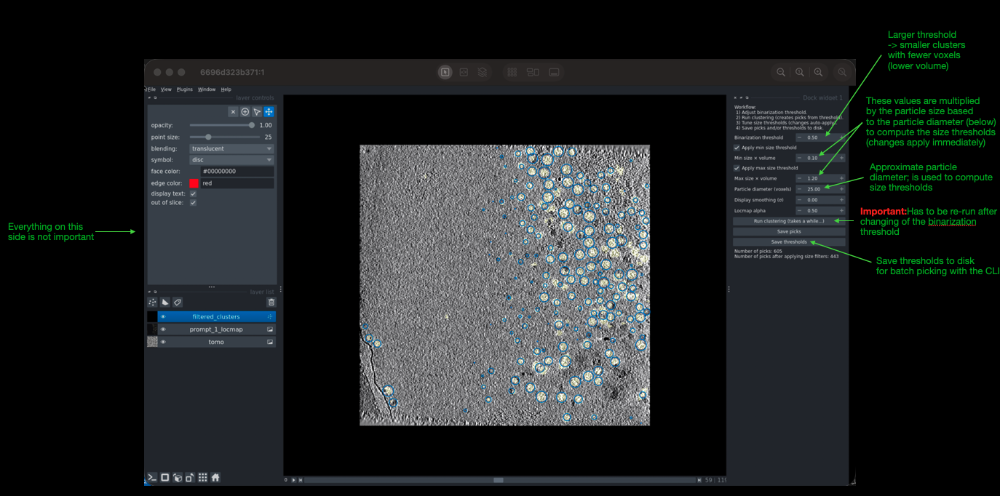

# ProPicker GUI Quickstart

## Overview
The prompt-based picking workflow with ProPicker involves four main steps:
1) Pick prompts in one tomogram with `propicker-prompt-selector`.
2) Segment tomograms into locmaps with `propicker-predict-locmap` using those prompts.
3) Tune thresholds to turn locmaps into picks with `propicker-pick-from-locmap-gui`.
4) Generate picks for all tomograms in batch with `propicker-pick-from-locmap` using the saved thresholds.

## Install
1. Install ProPicker and dependencies as described in [README.md](README.md).
2. Install system deps for Qt/napari (Ubuntu/Debian) so GUIs render correctly.

   **CAUTION:** The following modifies system packages. We recommend trying the GUI without running these commands first, and installing them if you encounter issues.
   ```bash
   sudo apt-get update && sudo apt-get install -y \
     libgl1 libegl1 libopengl0 libgl1-mesa-dri libgl1-mesa-glx \
     libglib2.0-0 libxcb-cursor0 libxkbcommon-x11-0 libfontconfig1 \
     libdbus-1-3 libx11-xcb1 libxrender1 libsm6 libice6 libxext6 \
     libxi6 libxcomposite1 libxcursor1 libxtst6 libxrandr2 libxdamage1 libxss1
   ```
3. Install these if you want to use the GUI from a remote server via VNC:
   ```bash
   sudo apt-get install -y xvfb x11vnc
   ```

## Tutorial
We provide a demo for prompt-based picking of ribosomes from an EMPIAR-10045 tomogram.

0) Download Data:
   ```bash
   # you can change OUT_DIR to any directory you like
   OUT_DIR=.
   # download a demo tomogram from EMPIAR-10045 (see figshare entry for details)
   wget --content-disposition "https://ndownloader.figshare.com/files/47423593"
   TOMO_FILE=$OUT_DIR/tomo.mrc
   mv "./fbp+wiener.mrc" $TOMO_FILE. # fbp+wiener is the file we just downloaded
   ```

   This downloads a demo tomogram and prompt subtomograms into the current directory.


1) Select prompt (GUI):
   ```bash
   # vnc settings for when running on remote server
   VNC_PASSWORD=propicker123
   VNC_PORT=5901

   propicker-prompt-selector --tomo $TOMO_FILE --output-dir $OUT_DIR/prompts --vnc --vnc-port $VNC_PORT --vnc-password $VNC_PASSWORD 
   ```
   You can omit the `--vnc` options if you are running on a local machine with display.
   The GUI looks like this:
   

2) Use prompted ProPicker to predict locmaps (CLI):

   Use the selected prompts to predict locmaps for the tomogram. You can also use multiple tomograms here, see the output of `propicker-predict-locmap --help` for details.

   ```bash
   PROPIKCER_CKPT=/PATH/TO/propicker.ckpt
   TOMOTWIN_CKPT=/PATH/TO/tomotwin.pth

   propicker-predict-locmap --tomo $TOMO_FILE --invert-contrast --prompt-subtomos $OUT_DIR/prompts --output-dir $OUT_DIR/pred_locmaps --subtomo-overlap 16 --device cuda:2 --propicker-ckpt $PROPIKCER_CKPT --tomotwin-ckpt $TOMOTWIN_CKPT

   ```
   **Important:** Use `--invert-contrast` if necessary to ensure particles appear bright (white) on dark background in the tomogram.

3) Threshold tuning (GUI):
   Tune the thresholds on one of the locmaps predicted in Step 2. In this tutorial, we have only one tomogram, so we use that one.

   ```bash
   TOMO_BASENAME=$(basename -- "$TOMO_FILE")
   TOMO_NAME="${TOMO_BASENAME%.*}"

   propicker-pick-from-locmap-gui --locmap $OUT_DIR/pred_locmaps/${TOMO_NAME}_pred_locmaps.pt --prompt prompt_1 --tomo $TOMO_FILE --output-dir $OUT_DIR/picks --vnc --vnc-port $VNC_PORT --vnc-password $VNC_PASSWORD
   ```
   The GUI looks like this:
   

   **Note:** The prompt cannot be changed in the GUI, it must be specified via `--prompt`.

4) Optional: Batch picking from locmaps (CLI):
   ```bash
   propicker-pick-from-locmap --pred-locmap ... --prompt prompt_1 --thresholds-json $OUT_DIR/picks/thresholds.json --output-dir picks
   ```
   You can apply cluster-based picking to all predicted locmaps from Step 2 using the thresholds saved from Step 3 or with custom thresholds. See `propicker-pick-from-locmap --help` for details.

